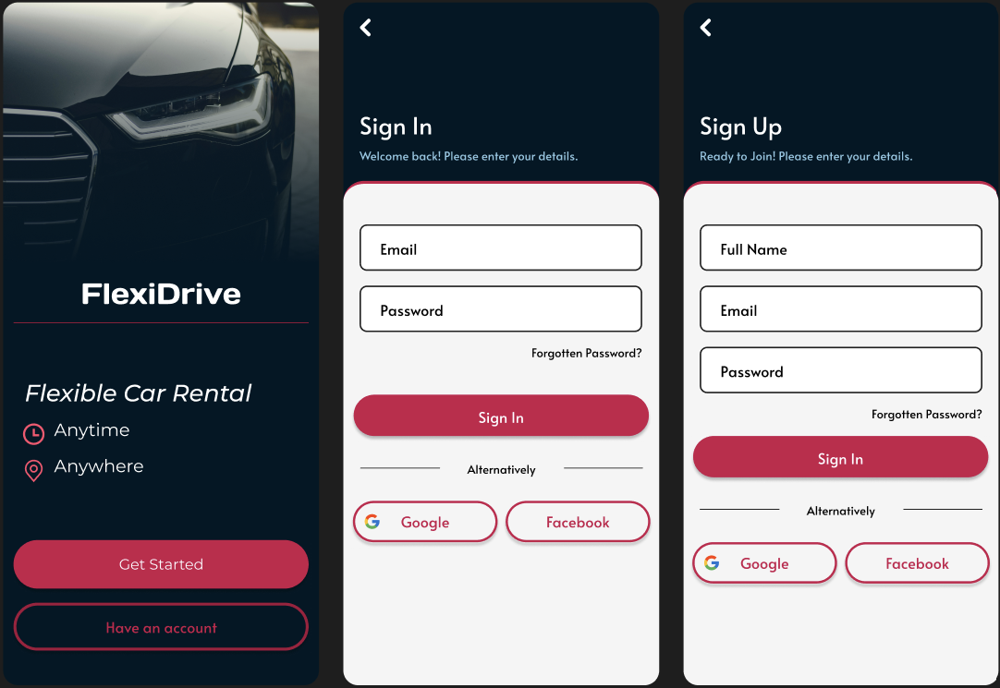
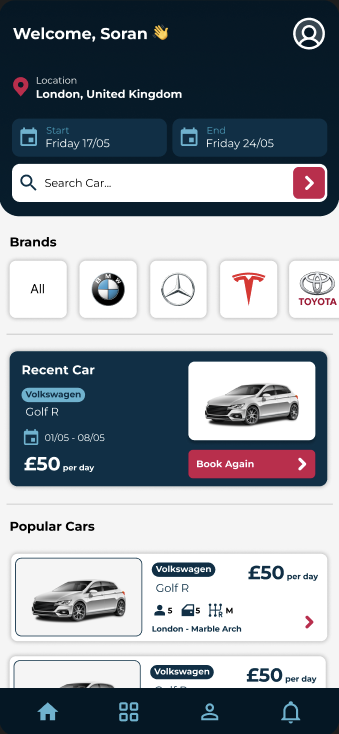

# FlexiRent - Car Rental App

## Overview

Welcome to the FlexiRent Car Rental App! This is a full-stack Android application designed to streamline the process of renting and managing cars. Developed using Kotlin and Android Studio, the app leverages Firebase for backend services and incorporates the MVVM architecture for robust and maintainable code.

## Features

- **User Authentication**: Secure sign-in and sign-up functionality using Firebase Authentication.
- **Vehicle Search and Booking**: Browse available cars, check their details, and book them in real-time.
- **Real-Time Availability Updates**: Stay updated with the latest information on vehicle availability.
- **Payment Integration**: Seamless payment processing for car rentals.
- **User-Friendly Interface**: Intuitive and attractive UI designed with Figma.
- **Notifications**: Receive notifications about booking status and updates.

## Technologies Used

- **Kotlin**: For app development.
- **Android Studio**: Integrated Development Environment (IDE) used for development.
- **Firebase**: Backend services including Authentication, Firestore, and Cloud Functions.
- **MVVM Architecture**: Model-View-ViewModel architecture for a clean separation of concerns and better testability.
- **Figma**: For UI/UX design.

## Installation

1. **Clone the Repository**:
    ```bash
    git clone https://github.com/yourusername/car-rental-app.git
    ```
2. **Open in Android Studio**:
    - Open Android Studio.
    - Click on `File` > `Open` and navigate to the cloned repository.

3. **Configure Firebase**:
    - Create a new project in [Firebase Console](https://console.firebase.google.com/).
    - Add an Android app to your Firebase project.
    - Download the `google-services.json` file and place it in the `app/` directory of your Android project.
    - Enable Authentication and Firestore in the Firebase Console.
    - Create or update your `local.properties` file in the root of your project and add your API key:
        ```properties
        API_KEY=your_api_key_here
        ```

4. **Build and Run**:
    - Connect your Android device or start an emulator.
    - Click on `Run` > `Run 'app'`.

## Usage

- **Sign Up/Sign In**: Create a new account or sign in with existing credentials.
- **Browse Cars**: View available cars with details such as model, price, and availability.
- **Book a Car**: Select a car, choose rental dates, and book the car.
- **Manage Bookings**: View your booking history and upcoming rentals.
- **Notifications**: Get notified about your booking status and updates.

## Screenshots





## Contact

If you have any questions or suggestions, feel free to reach out:

- **Email**: azizsoran01@gmail.com
- **LinkedIn**: [Aziz Soran](https://www.linkedin.com/in/aziz-soran/)

---

Thank you for checking out the Car Rental App! We hope you find it useful and easy to use.
